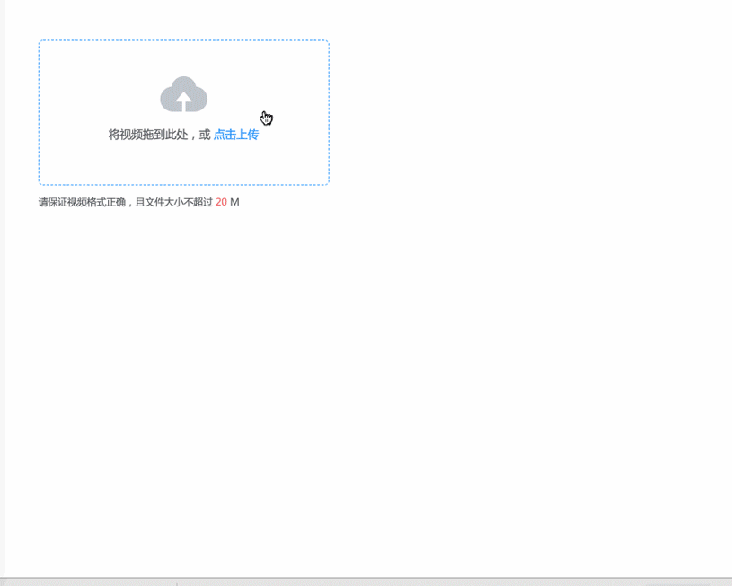

# vue-ele-upload-video | 使得视频上传更加容易

[](https://opensource.org/licenses/mit-license.php)
[](https://www.npmjs.com/package/vue-ele-upload-video)
[](https://www.npmjs.com/package/vue-ele-upload-video)
[](https://npmcharts.com/compare/vue-ele-upload-video?minimal=true)

## 介绍

vue-ele-upload-video 对 element-ui 中 upload 组件进一步封装，使得视频上传更加容易

## 效果图



## 在线示例

[https://codepen.io/dream2023/pen/ZNVvBg/](https://codepen.io/dream2023/pen/ZNVvBg/)

## 安装

```bash
npm install vue-ele-upload-video --save
```

## 使用

```js
// 全局引入
import EleUploadVideo from 'vue-ele-upload-video'
Vue.component(EleUploadVideo.name, EleUploadVideo)
```

```js
// 局部引入
import EleUploadVideo from 'vue-ele-upload-video'
export default {
  components: {
    EleUploadVideo
  }
}
```

## 示例(上传到七牛云)

```html
<template>
  <ele-upload-video
    :data="{
      token: token
    }"
    :limit="20"
    @error="handleUploadError"
    :responseFn="handleResponse"
    style="margin: 50px"
    url="https://upload.qiniup.com/"
    v-model="video"
  />
</template>

<script>
  export default {
    data() {
      return {
        // 上传时需要携带后台请求的token
        token: 'xxxx',
        video: ''
      }
    },
    methods: {
      handleUploadError(error) {
        console.log('error', error)
      },
      handleResponse(response) {
        return 'https://www.xxx.com/upload/video/' + response.id
      }
    }
  }
</script>
```

## Props 参数

```js
props: {
  // 值
  value: {
    type: String,
    required: true
  },
  // 上传地址
  url: {
    type: String,
    required: true
  },
  // 文件大小限制(Mb), 默认10Mb
  limit: {
    type: Number,
    default: 10
  },
  // 响应处理函数
  responseFn: Function,
  // 显示宽度(px)
  width: {
    type: Number,
    default: 360
  },
  // 显示高度(默认auto)
  height: {
    type: Number
  },
  // 上传时附带的数据, 选填
  data: {
    type: Object
  },
  // 文件类型
  fileType: {
    type: Array,
    default () {
      return ['video/mp4', 'video/ogg', 'video/flv', 'video/avi', 'video/wmv', 'video/rmvb']
    }
  },
  // upload组件自定义其他属性
  customAttrs: {
    type: Object
  }
}
```

## 参考链接

- [element-ui upload 组件](https://element.eleme.cn/#/zh-CN/component/upload)
- [element-ui progress 组件](https://element.eleme.cn/#/zh-CN/component/progress)
